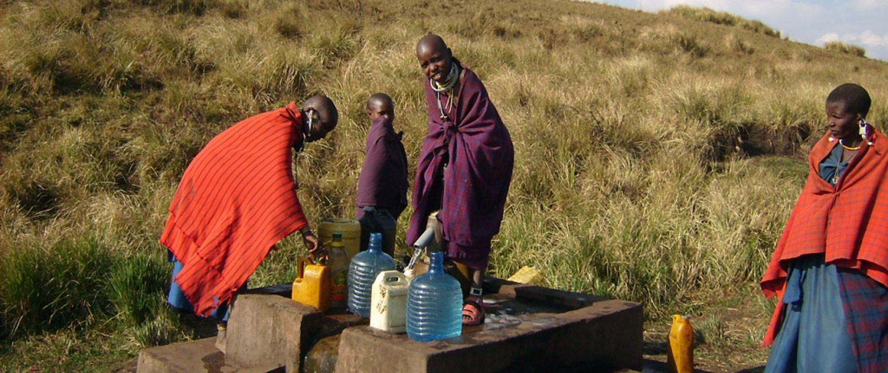

# Tanzania Waterpoint Functionality Classification using Random Forest

Author: **Chi Bui**

## Overview 

Tanzania is in the midst of a water crisis: 4 million people in the country do not have access to a source of safe water, and 30 million people lack access to improved sanitation. People living in such circumstances, particulary women and children, usually bear the responsibility of collecting water in their communities, spending a significant amount of time traveling long distances to collect water several trips each day.

The objective of this project is to use **Random Forest**, a powerful ensemble method to perform a **ternary classification** of the functionality of the water wells in Tanzania.

## Business Problems

Almost half the population of Tanzania is without basic access to safe water. Although there are many waterpoints already established in the country, a lot of them are in need of repair while others have failed altogether. 

The model built in this project could be utilized as one of the first steps in the waterpoint functionality diagnostic process. It can assist the Tanzanian Ministry of Water on identifying pumps that are in need of repair and/or no longer functional. A better understanding of which features might be contributing to waterpoints functionality could help improve maintenance operations, and ensure that safe, clean water becomes available to more people across the country.

## Dataset

The dataset provided on https://www.drivendata.org/ by **Taarifa** and the **Tanzanian Ministry of Water**. More details on the competition could be found [here](https://www.drivendata.org/competitions/7/pump-it-up-data-mining-the-water-table/page/23/).

Please note that for the actual competition, the use of external data is not allowed. However, I did incorporate data from 2 external sources in my own analysis project. 

## Exploratory Data Analysis (EDA)

The master training set that I would be working with contains 59,364 entries and 40 columns, with the target variable being **`status_group`**.

```
functional                 0.54304
non functional             0.38429
functional needs repair    0.07267
```

A breakdown of the `status_group` class frequencies show that this dataset has some class imbalances that would have to be addressed during modeling. Although this is a **ternary** dataset, one class `"functional"` takes up 54.30% of the whole training dataset, while `"functional needs repair"` is only 7.27%.

#### Geospatial data vs `status_group`


The minimum `longitude` in this dataset is 0. Realistically, longitudes for Tanzania should be in the 29-40 range, and definitely should not be lower than 28. Therefore, these 0 values in `longitude` are most likely placeholders, and should be treated as missing values later on.