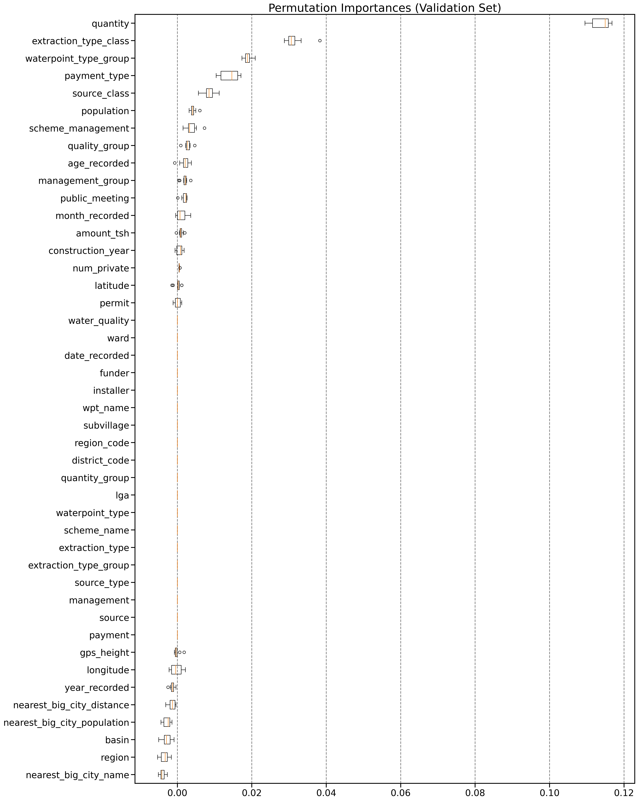

# Tanzania Waterpoint Functionality Classification using Random Forest

Author: **Chi Bui**


## This Repository

### Repository Directory

```
├── README.md               <-- Main README file explaining the project's business case,
│                           methodology, and findings
│ 
├── data                    <-- Data in CSV format
│
├── notebook                <-- Jupyter Notebooks for exploration and presentation
│   ├── exploratory         <-- Unpolished exploratory data analysis (EDA) and modeling notebooks
│   ├── tanzania_cities     <-- External data processing notebook
│   └── report              <-- Polished final notebook
│ 
├── predictions             <-- Generated predictions on the testing dataset (for competition submission)
│
├── reports                 <-- Generated analysis (including presentation.pdf)
│
└── images                  <-- Generated graphics and figures to be used in reporting
```

### Quick Links

1. [Final Analysis Notebook](./notebook/report/final_report.ipynb)
2. [Presentation Slides](./reports/presentation.pdf)


## Overview 

Tanzania is in the midst of a water crisis: 4 million people in the country do not have access to a source of safe water, and 30 million people lack access to improved sanitation. People living in such circumstances, particulary women and children, usually bear the responsibility of collecting water in their communities, spending a significant amount of time traveling long distances to collect water several trips each day.

The objective of this project is to use **Random Forest**, a powerful ensemble method to perform a **ternary classification** of the functionality of the water wells in Tanzania.


## Business Problems

Almost half the population of Tanzania is without basic access to safe water. Although there are many waterpoints already established in the country, a lot of them are in need of repair while others have failed altogether. 

The model built in this project could be utilized as one of the first steps in the waterpoint functionality diagnostic process. It can assist the Tanzanian Ministry of Water on identifying pumps that are in need of repair and/or no longer functional. A better understanding of which features might be contributing to waterpoints functionality could help improve maintenance operations, and ensure that safe, clean water becomes available to more people across the country.

## Dataset

The dataset provided on https://www.drivendata.org/ by **Taarifa** and the **Tanzanian Ministry of Water**. More details on the competition could be found [here](https://www.drivendata.org/competitions/7/pump-it-up-data-mining-the-water-table/page/23/).

Please note that for the actual competition, the use of external data is not allowed. However, I did incorporate data from 2 external sources in my own analysis project. 


## Exploratory Data Analysis (EDA)

The master training set that I would be working with contains 59,364 entries and 40 columns, with the target variable being **`status_group`**.

```
functional                 0.54304
non functional             0.38429
functional needs repair    0.07267
```

A breakdown of the `status_group` class frequencies show that this dataset has some class imbalances that would have to be addressed during modeling. Although this is a **ternary** dataset, one class `"functional"` takes up 54.30% of the whole training dataset, while `"functional needs repair"` is only 7.27%.

### Numerical Features

#### Geospatial data vs `status_group`


We can see that waterpoints are more densely distributed in some regions that in others. 
- There seems to be a high amount of `non functional` wells in the Southeast and Northwest regions of Tanzania. 
- Also, there are some large open spaces without any waterpoints being recorded. I'm not sure if this is just a lack of data, or lack of actual wells in these areas, or a combination of both. 

In addition, visually we can also see that more of the "larger" waterpoints (meaning they're higher in altitude `gps_height`) have been recorded as `functional`. 

#### `longitude`


The minimum `longitude` in this dataset is 0. Realistically, longitudes for Tanzania should be in the 29-40 range, and definitely should not be lower than 28. Therefore, these 0 values in `longitude` are most likely placeholders, and should be treated as missing values later on.

#### `gps_height`


0 is also the mode of `gps_height` with approx. 34.3% the dataset. `gps_height` is explained as the "Altitude of the well" and since wells do go underground, it makes sense that 1496 of the datapoints have negative `gps_height`. 

One of the biggest challenges of this project is the large amount of 0s being used as placeholder for missing data in almost every numerical features. These 0 values also take up large portions of those each column.

### Categorical Features

#### `region`


- **Iringa** is on the top in terms of both number of wells and functional wells proportion.
- Largest city and former capital **Dar es Salaam** has the least amount of wells, and also a very small portion of them are identified as `functional needs repair`
- **Lindi** has more wells than **Dar es Salaam**, but yet a very high portion of them are `non functional`. 

We can see there's some sort of relationship between the region/location of the well and its functionality, which does make sense. Wells in certain locations are perhaps receiving better maintenance from the local management, or somehow constructed better by certain installer than others. 

In addition to this, one of the few things that can caused well water contamination is the polution coming from nearby large residential areas, as well as industrial factories, plants, construction sites, etc. 

#### `quantity`


Again, similar to `quantity`, the percentage of `non functional` in the **unknown** group is a lot higher than the others.

#### `extraction_type`


- **rose_pump** appears to have a higher than average proportion of `functional` wells of approx. **65%**
- while **other** has a very high percentage of `non functional` waterpoints of **80.7%**

#### `waterpoint_type`


| waterpoint_type             |   functional |   functional needs repair |   non functional |
|:----------------------------|-------------:|--------------------------:|-----------------:|
| dam                         |     0.857143 |                 0         |         0.142857 |
| cattle trough               |     0.724138 |                 0.0172414 |         0.258621 |
| improved spring             |     0.717752 |                 0.108557  |         0.173691 |
| communal standpipe          |     0.621476 |                 0.0792187 |         0.299306 |
| hand pump                   |     0.617714 |                 0.0588    |         0.323486 |
| communal standpipe multiple |     0.36629  |                 0.106247  |         0.527464 |
| other                       |     0.131723 |                 0.0459464 |         0.82233  |


- In this case, looking at the normalized version of the contingency table alone could be misleading. **dam** and **cattle trough** have a very high percentage of `functional` wells; however, in the grand scheme of things, there're not really that many wells in these 2 groups altogether.
- What I find interesting here is the proportions of `non functionnal` in the 2 groups **other** (82%) and **communal standpipe multiple** (52%) which are a lot higher than the population's percentage of `non functional` (38%).

#### `source`

| source               |   functional |   functional needs repair |   non functional |
|:---------------------|-------------:|--------------------------:|-----------------:|
| spring               |     0.622268 |                0.0749706  |         0.302761 |
| rainwater harvesting |     0.604012 |                0.136502   |         0.259485 |
| other                |     0.597156 |                0.00473934 |         0.398104 |
| hand dtw             |     0.56865  |                0.0194508  |         0.411899 |
| river                |     0.56856  |                0.127029   |         0.304411 |
| shallow well         |     0.494554 |                0.0568419  |         0.448604 |
| machine dbh          |     0.489385 |                0.0443581  |         0.466257 |
| unknown              |     0.484848 |                0.0606061  |         0.454545 |
| dam                  |     0.38626  |                0.0366412  |         0.577099 |
| lake                 |     0.21232  |                0.0157274  |         0.771953 |


- There are a significant amount of wells in the **shallow well**; and the percentage of `non functional` in this group is higher than average (44.8% compared to 38%).
- **rainwater harvesting** does not have too many wells, yet the percentage of `functional` well here is relatively high (60% compare to the average of 53%).

#### `date_recorded`

The proportions of well functionality in **rainwater harvesting** has led me to think that perhaps the functionality of the wells are also partially impacted by the time of the year the inspection/measurement was recorded. I'll extract the month & year from `date_recorded` to create new columns to see if there's any potential relationship between the record time and outcome.

| month_recorded   |   functional |   functional needs repair |   non functional |
|:-----------------|-------------:|--------------------------:|-----------------:|
| Jun              |     0.780347 |                 0.0260116 |         0.193642 |
| Sep              |     0.652439 |                 0.0304878 |         0.317073 |
| Mar              |     0.616525 |                 0.0501784 |         0.333296 |
| May              |     0.60119  |                 0.0297619 |         0.369048 |
| Dec              |     0.587762 |                 0.0338164 |         0.378422 |
| Feb              |     0.551997 |                 0.0752723 |         0.372731 |
| Apr              |     0.516373 |                 0.110327  |         0.3733   |
| Aug              |     0.511303 |                 0.0752528 |         0.413444 |
| Oct              |     0.509351 |                 0.0577558 |         0.432893 |
| Jul              |     0.501084 |                 0.0793697 |         0.419546 |
| Nov              |     0.494065 |                 0.0519288 |         0.454006 |
| Jan              |     0.410487 |                 0.126909  |         0.462604 |


| month_recorded   |        dry |   enough |   insufficient |   seasonal |    unknown |
|:-----------------|-----------:|---------:|---------------:|-----------:|-----------:|
| Sep              | 0.20122    | 0.554878 |       0.210366 |  0.0304878 | 0.00304878 |
| Dec              | 0.198068   | 0.58132  |       0.183575 |  0.0354267 | 0.00161031 |
| Jan              | 0.170997   | 0.534719 |       0.193985 |  0.0706975 | 0.0296016  |
| Jul              | 0.136186   | 0.555009 |       0.24794  |  0.0481423 | 0.0127223  |
| Nov              | 0.10905    | 0.547478 |       0.217359 |  0.10089   | 0.0252226  |
| Aug              | 0.106782   | 0.531826 |       0.262344 |  0.0832838 | 0.0157644  |
| Feb              | 0.10004    | 0.574264 |       0.263171 |  0.0523598 | 0.0101654  |
| Oct              | 0.0916758  | 0.566373 |       0.217088 |  0.112028  | 0.0128346  |
| Apr              | 0.0889169  | 0.551134 |       0.218136 |  0.137028  | 0.00478589 |
| Mar              | 0.0788359  | 0.556813 |       0.296833 |  0.0559768 | 0.011541   |
| May              | 0.0297619  | 0.675595 |       0.27381  |  0.0178571 | 0.00297619 |
| Jun              | 0.00867052 | 0.728324 |       0.248555 |  0.0115607 | 0.00289017 |

I think it's not coincident that **June** appears to record the highest amount of `functional` wells, and lowest amount of **dry** wells. Although Tanzania is a very big country, and the climate does vary considerably within it, generally, the main long rainy season lasts during **March**, **April**, and **May**.  

Overall, this EDA has shown that there are certainly values in the **`unknown`**s and **`other`**s of this dataset. Therefore, for all the categorical variables with missing values to be included in modeling, I will impute them with the string **`"NaN"`** instead of dropping them.


## Modeling

### Metrics

The main metric that I would be using to access my models' performance here is **Accuracy Score**. However, for this specific problem, we would also want to be able to identify non-operational waterpoints as well as those that are in need of repair early on, to help the Tanzanian Ministry of Water dispense resources and labors accordingly. Therefore, I would also be looking at **Recall Score** particularly of the 2 classes `non functional` and `functional needs repair` in evaluating my models.

### Train Test Split

After assigning all the independent variables to `X_master` dataframe, and separating the target variable `status_group` and assign to `y_master` dataframe, I proceeded to split the data into 3 smaller sets:

1. **Training** `X_tt` and `y_tt` (33,392 datapoints) - used for training 
2. **Validation** `X_val` and `y_val` (11,131 datapoints) - used for model selection/tuning/tweaking
3. **Testing** `X_test` and `y_test` (14,841 datapoints) - used for testing

The purpose of splitting data up this way is to ensure the models are being trained on 1 set of data, and validated on another. The performance of the models on validation as well as testing sets would then let us know how well the models can generalize to unseen data after being trained. 


### Building Preprocessing Pipeline

This dataset contains groups of features that indicate similar features of the wells, such as:
- `extraction_type`, `extraction_type_group`, and `extraction_type_class`
- `water_quality` and `quality_group`
- `quantity` and `quantity_group` (although further investigating on these 2 features shows that they actually store the exact same information)
- `source`, `source_type`, `source_type_class`
- `waterpoint_type` and `waterpoint_type_group`
- `payment` and `payment_type`

Focusing on the more specific categories would lead to the models containing too many features and slow down runtimes; while these more specific variables might not necessarily offer more values than the general ones. Therefore, for this model, I would only focus on the most generalized features in each of these group instead of including all of them. For example:
- Among `extraction_type`, `extraction_type_group`, and `extraction_type_class`, I would go with `extraction_type_class`
- Between `waterpoint_type` and `waterpoint_type_group`, I would choose `waterpoint_type_group`

The objective of building a pipelines is to help streamline preprocessing, and prevent data leakage during cross validation in the modeling phase. Once a pipeline is built, it can be fitted to training data, then used to transform testing data quickly and effectively.


### 1. Add Extra Features

#### 1.1. Extract Month/Year and Age Recorded Information from `date_recorded`

The purpose of this step is to extracts information from datetime column to create new features:

- `month_recorded`: first 3 character of name of the month recorded
- `year_recorded`: four-digit year
- `age_recorded`: difference between construction year and year recorded

#### 1.2. Adding Extra Features Regarding Big Cities

Although the competition itself does not allow the use of external data, I think there are meaningful ways we can incorporate external data into improving the overall predictive power and interpretability of the models here, especially when there is such a large amount of missing information in this dataset. 

Therefore, I would use external data my own study, and then remove this transformation from the pipeline when making predictions on testing data for the competition. 

The outcome of this step is to create 3 additional features:
- `nearest_big_city_name`: name of the nearest city with population over 100,000
- `nearest_big_city_distance`: distance to nearest city with population over 100,000
- `nearest_big_city_population`: population of nearest big city

### 2. Preprocessing

#### 2.1. Fill in missing values with string `"NaN"` in some Categorical & Boolean Variables

For 3 columns: `public_meeting`, `scheme_management`, `permit`

#### 2.2. Impute Longitude

The purpose of this step is to replace 0 values in longitudes with the aggregated means by region using `region_code`. The main reason I am using `region_code` as the groupby feature is purely because there are more unique values in `region_code` than in `region`.

#### 2.3. Binning `funder` & `installer` into 2 groups **major** and **minor**

Each of these 2 variables contains over 1,000 possible categories, which means that if I were to include them all as is into the model, I would end up with over 4,000 features after One Hot Encoding. One way to deal with high-cardinality in these 2 variables is by binning them into bigger groups:

- **major** - top 100 funders or installers - responsible for around 80% of the water wells in the dataset used for fitting
- **minor** - any entities that are not in the top 100 list

#### 2.4. Scaling Numerical Features

The numerical features I would be including in my models are:
`amount_tsh`, `gps_height`, `num_private`, `construction_year`, `year_recorded`, `age_recorded`, `population`, `nearest_big_city_population`, `longitude`, `latitude`, `nearest_big_city_distance`

- Scaling Longitude and Latitude are especially important here because they're on different scales.
- From experiments with different scalers, `MinMaxScaler()` was found to be the one that yields better results compared to other types of scaling (including `StandardScaler()`, `RobustScaler()`, and `PowerTransformer()`).

#### 2.5. One Hot Encoding Categorical Features

The categorical features I would be including in my models are:
`funder`, `installer`, `basin`, `region`, `public_meeting`, `scheme_management`, `permit`, `extraction_type_class`, `management_group`, `payment_type`, `quality_group`, `quantity`, `source_class`, `waterpoint_type_group`, `nearest_big_city_name`, `month_recorded`


## 1. Inferential Model

After experimenting with different algorithms and hyperparameter tuning techniques, I decided to go with **RandomForestClassifier** because so far it the highest overall accuracy score. In addition, Random Forest are robust, can generalize well, and overall more interpretable than some of the other algorithms. More details on different algorithm testing could be found in the [exploratory](./notebook/exploratory/) folder.

### Random Forest with Class Imbalance

The first inferential model was fitted on training data as is, with 2 major classes: `functional` and `non functional`, and 1 minor class `functional needs repair`. 

Below is the **Classification Report** of 5-fold Cross Validation using the Accuracy Score as the main metric of the first model (`rf1`):

```
                         precision    recall  f1-score   support

             functional       0.80      0.86      0.83      3623
functional needs repair       0.49      0.33      0.40       483
         non functional       0.80      0.77      0.78      2573

               accuracy                           0.79      6679
              macro avg       0.70      0.65      0.67      6679
           weighted avg       0.78      0.79      0.78      6679

                         precision    recall  f1-score   support

             functional       0.80      0.87      0.84      3623
functional needs repair       0.52      0.31      0.39       483
         non functional       0.81      0.78      0.80      2573

               accuracy                           0.80      6679
              macro avg       0.71      0.66      0.68      6679
           weighted avg       0.79      0.80      0.79      6679

                         precision    recall  f1-score   support

             functional       0.80      0.87      0.83      3622
functional needs repair       0.53      0.32      0.40       482
         non functional       0.83      0.77      0.80      2574

               accuracy                           0.79      6678
              macro avg       0.72      0.66      0.68      6678
           weighted avg       0.79      0.79      0.79      6678

                         precision    recall  f1-score   support

             functional       0.80      0.86      0.83      3622
functional needs repair       0.47      0.32      0.38       482
         non functional       0.81      0.78      0.80      2574

               accuracy                           0.79      6678
              macro avg       0.69      0.65      0.67      6678
           weighted avg       0.78      0.79      0.78      6678

                         precision    recall  f1-score   support

             functional       0.79      0.87      0.83      3622
functional needs repair       0.51      0.32      0.40       482
         non functional       0.82      0.76      0.79      2574

               accuracy                           0.79      6678
              macro avg       0.71      0.65      0.67      6678
           weighted avg       0.78      0.79      0.78      6678
```

Cross validation allows us to get a sneak peek into how well the models generalize to data it has not seen. It works by splits training data into smaller groups (number of groups can be changed by assigning values to the `cv` parameter, otherwise, by default `cv=5`). 

For example, in the cross validation above, my training data was split into 5 smaller portions, then a training/validation loop is performed 5 times on the model, each time the model gets trained on 4 portions of the data, and validated on 1 (the validation portion changes every round). 

```
Cross Validation Accuracy Scores: [0.78514748 0.79532864 0.7949985  0.79035639 0.78885894]

Average Accuracy: 0.7909379911315011
```

On average, this model accurately predicts the statuses of approximately 79% of the waterpoints.

However, just looking at the Accuracy Score in this case is not enough. The above Classification Report also shows that Recall Score on the `functional needs repair` class is very low (averaging 32%). Recall Score for a certain class is the percentage of that class in actual obervations being correctly identified by the model. This low Recall score means that this model is still mis-classifying a lot of `functional needs repair` as the other 2 classes.

The model has such a poor performance on this class compared to the other 2 perhaps due to less exposure to the `functional needs repair`. 

Therefore, I would next look at countering Class Imbalance by using SMOTE to synthesize new examples by oversampling imbalanced set.

### Random Forest with Oversampling (SMOTE)

A problem with imbalanced classification is that there are too few examples of the minority class for a model to effectively learn the decision boundary. One of the techniques that is very widely use to counter class imbalance is by oversampling the minority class. Merely duplicating the examples in the training dataset might balance the classes, but does not provide any additional information for our model. **Synthetic Minority Oversampling Technique** or **SMOTE** for short, works by synthesizing new examples for the minority class.

Below is the **Classification Report** of 5-fold Cross Validation on a second Random Forest Classifier model that utilizes SMOTE (`rf2`):

```
                         precision    recall  f1-score   support

             functional       0.81      0.84      0.82      3623
functional needs repair       0.41      0.44      0.42       483
         non functional       0.81      0.76      0.79      2573

               accuracy                           0.78      6679
              macro avg       0.68      0.68      0.68      6679
           weighted avg       0.78      0.78      0.78      6679

                         precision    recall  f1-score   support

             functional       0.81      0.84      0.83      3623
functional needs repair       0.40      0.42      0.41       483
         non functional       0.82      0.77      0.79      2573

               accuracy                           0.78      6679
              macro avg       0.68      0.68      0.68      6679
           weighted avg       0.78      0.78      0.78      6679

                         precision    recall  f1-score   support

             functional       0.80      0.84      0.82      3622
functional needs repair       0.41      0.43      0.42       482
         non functional       0.82      0.76      0.79      2574

               accuracy                           0.78      6678
              macro avg       0.68      0.68      0.68      6678
           weighted avg       0.78      0.78      0.78      6678

                         precision    recall  f1-score   support

             functional       0.81      0.83      0.82      3622
functional needs repair       0.39      0.42      0.40       482
         non functional       0.81      0.77      0.79      2574

               accuracy                           0.78      6678
              macro avg       0.67      0.67      0.67      6678
           weighted avg       0.78      0.78      0.78      6678

                         precision    recall  f1-score   support

             functional       0.80      0.85      0.82      3622
functional needs repair       0.42      0.43      0.42       482
         non functional       0.82      0.75      0.79      2574

               accuracy                           0.78      6678
              macro avg       0.68      0.68      0.68      6678
           weighted avg       0.78      0.78      0.78      6678
           
Cross Validation Accuracy Scores: [0.77826022 0.78290163 0.78137167 0.77747829 0.77942498]

Average Accuracy: 0.7798873566381979
```

Overall, average accuracy score has **dropped by 1.1%**. Although this is not to big of a difference, the print out of classification reports show that the Recall Score for functional needs repair has improved (from 32% to 42%). This new Recall Score is still relatively pretty modest, yet it's indicating that the new model has accurately identified a higher percentage of of the actual `functional needs repair` waterpoints.

A slight drop in accuracy after oversampling means that the model perhaps still has not learned to differentiate the classes very well. Since functional needs repair is so under-represented, it was able to achieve higher accuracy score in the first model purely by predicting more of the other 2 classes without actually picking up the differences among them.

Between the 2 models `rf1` and `rf2` I would go with the second one, because it performs better on the less represented class, and thus offers more meaning than the first model.

#### Model Evaluation

After training `rf2` on the whole training dataset, the model performs very well on predicting the status outcomes for the training dataset `X_tt` with an Accuracy Score of 0.99 or 99%:

```
                         precision    recall  f1-score   support

             functional       1.00      0.99      1.00     18112
functional needs repair       0.95      0.99      0.97      2412
         non functional       1.00      1.00      1.00     12868

               accuracy                           0.99     33392
              macro avg       0.98      0.99      0.99     33392
           weighted avg       0.99      0.99      0.99     33392
```

However, the performance on the Validation dataset is approx. 20% lower in Accuracy (at 79%):

```
                         precision    recall  f1-score   support

             functional       0.81      0.84      0.83      6038
functional needs repair       0.40      0.47      0.43       819
         non functional       0.83      0.77      0.80      4274

               accuracy                           0.79     11131
              macro avg       0.68      0.69      0.69     11131
           weighted avg       0.79      0.79      0.79     11131
```

This means that the model is **overfitting** to the training data, and is picking up too much of the on the random noises of the training data. 

#### Confusion Matrix


From the confusion matrix, we can see that my current model is still predicting a lot of `functional needs repair` as `functional`. 

#### Feature Importances


Based on this inferential Random Forest model `rf2`, the top 10 most important features identified are:
1. `longitude`
2. `latitude`
3. `nearest_big_city_distance`
4. `quantity_dry`
5. `gps_height`
6. `age_recorded`
7. `construction_year`
8. `population`
9. `quantity_enough`
10. `extraction_type_class_other`

This results show that the location (`longitude`/`latitude`) of the waterpoints do contribute to their functionality signficantly. This could be due to various reasons, from natural climate, and or something more human-induced such as the lack of funding and/or maintenance executed by different entities in different regions.

And then we have the distance to nearest big city (with population over 100,000), which is one of the 3 additional features I created using external sources of data. 

`quantity` appears twice (with **dry** and **enough**), which are understandable. 

`gps_height`'s imporantance also corresponds with the visualizations in EDA above.

Other factors such as the age of the waterpoint, the `population` living nearby, and `payment_type` have also been found to be important.

Since impurity-based feature importances have been known to be highly biased and have the tendency to inflate continuous/high-cardinality features over low-cardinality features (binary/or categorical features with a smaller number of possible categories),
I decided to test feature importances using another approach: **Permutation Feature Importance**.

**Permutation Feature Importance** works by selecting a variable in the validation set, shuffling it randomly to destroy the correlation between that variable and all the other ones used for prediction, and then measuring the models performance on the shuffled validation dataset. 

If the performance drops significantly, that means the feature selected must have been importance. The only problem is that it's computational expensive, and takes a **very long** time to execute.



Permutation Importance weeds out noises and features that might not be contributing significantly to the model.
- Looking at the plot above, we can see that on average, shuffling values in the `quantity` column would cause a drop of 11.4% in model performance. 
- On the other hand, breaking the connection between some features at the bottom of the charts (such as `nearest_big_city_name`, `region`, `basin`, etc.) seemed to have increased model performance.

Because of these results, I decided to try a model WITHOUT any of the features from `permit` down.

### Simplified Random Forest with Less Features

For this model `rf_perm`, I only include the following variables:

```
# SELECT NUMERICAL FEATURES TO BE INCLUDED IN MODELING
numerical_features_perm = ['amount_tsh', 'num_private', 'construction_year',
                           'age_recorded', 'population', 'latitude']

# SELECT CATEGORICAL FEATURES TO BE INCLUDED IN MODELING
categorical_features_perm = ['public_meeting', 'scheme_management',
                             'permit', 'extraction_type_class', 'management_group', 'payment_type', 
                             'quality_group', 'quantity', 'source_class', 'waterpoint_type_group']
```

Classification Report on the Training dataset:

```
                         precision    recall  f1-score   support

             functional       1.00      0.99      0.99     18112
functional needs repair       0.94      0.99      0.97      2412
         non functional       1.00      1.00      1.00     12868

               accuracy                           0.99     33392
              macro avg       0.98      0.99      0.99     33392
           weighted avg       0.99      0.99      0.99     33392
```

Classification Report on the Training dataset:

```
                         precision    recall  f1-score   support

             functional       0.80      0.81      0.80      6038
functional needs repair       0.35      0.45      0.39       819
         non functional       0.80      0.75      0.77      4274

               accuracy                           0.76     11131
              macro avg       0.65      0.67      0.66     11131
           weighted avg       0.77      0.76      0.76     11131
```

Droping 26 columns (`water_quality`, `ward`, `date_recorded`, `funder`, `installer`, `wpt_name`, `subvillage`, `region_code`, `quality_group`, `lga`, `waterpoint_type`, `scheme_name`, `extraction_type`, `extraction_type_group`, `source_type`, `management`, `source`, `payment`, `gps_height`, `longitude`, `year_recorded`, `nearest_big_city_distance`, `nearest_big_city_population`, `basin`, `region`, and `nearest_big_city_name`) only brought the accuracy on validation set down from 78% to 76%, which means the ones not included were probably not contributing significantly to the target variable.

It also helps speed up execution time by reducing the total number of features down by 50% to 64 (from 128). This version is definitely simplier, and more interpretable.


#### Model Evaluation

After being trained on the whole training dataset, below is the Classification Reports for Training and Testing sets:

```
TRAINING DATA:
                         precision    recall  f1-score   support

             functional       1.00      0.99      0.99     24150
functional needs repair       0.94      0.99      0.96      3231
         non functional       1.00      1.00      1.00     17142

               accuracy                           0.99     44523
              macro avg       0.98      0.99      0.99     44523
           weighted avg       0.99      0.99      0.99     44523
           
           
TESTING DATA:
                         precision    recall  f1-score   support

             functional       0.80      0.80      0.80      8087
functional needs repair       0.33      0.46      0.38      1083
         non functional       0.80      0.75      0.78      5671

               accuracy                           0.75     14841
              macro avg       0.64      0.67      0.65     14841
           weighted avg       0.77      0.75      0.76     14841
```

#### Confusion Matrix


This simplified model is still exhibiting overfitting tendencies. Accuracy score on the training set is almost perfect at 99%, while the score on the testing set is only 75%, which has widen the gap between training & testing performances compared to the previous model `rf2`. 

Although this final model that I have selected did not achieve the highest accuracy score, it contains less features and simpler to interpret. Since the goal for this section of my project is mainly to get a better understanding of the factors that might affect the functionality outcome of well pumps in Tanzania, this simple model has helped weed out some variables such as `basin` and `region`, and shift our focus to `extraction_type_class`, `waterpoint_type`, `payment_type`, etc, which can all be monitored, controlled, and improved upon by human. 


## 2. Competition Model

The goal for the competition model is slightly different from the inferential above. Instead of trying to understand what might be influencing the functionality outcomes of water pumps in Tanzania, I would be focusing more on **maximizing accuracy score**. 

Therefore, for my first model in this section, I would include all numeric features in the dataset. In addition, I would also convert `date_recorded` to numeric.

After experimenting with 2 different versions: one using SMOTE and one not, the one without SMOTE seems to have higher accuracy score (which is actually consistent with the Inferential Model Testing above). 

The Average Accuracy of the SMOTE model is: 0.7827622626801694
And Average Accuracy one without SMOTE model is: 0.7894703872409268

Accuracy increased (by 0.67%) just by removing SMOTE; therefore, I decided to keep heading in this direction, although Recall Score on functional needs repair of the second model is relatively low (averageing 31%).

After experimenting with other Scaler methods, I settled with a model as below:

```
# DEFINE TRANSFORMER USING StandardScaler()
ss_transformer = Pipeline(steps=[('scaler', StandardScaler())])

# TRANSFORM NUMERICAL & CATEGORICAL FEATURES SEPARATELY USING ColumnTransformer
col_tranformer_comp2 = ColumnTransformer(transformers=[('num', ss_transformer, numerical_features_all),
                                                       ('cat', categorical_transformer, categorical_features_comp)],
                                         remainder='drop')

# STACKING THEM TOGETHER IN A PIPELINE
preprocessor_comp2 = Pipeline(steps=[('fillna', NaNImputer()),
                                     ('lng_imp', LongitudeImputer()),
                                     ('funder', FunderBinner()),
                                     ('installer', InstallerBinner()),
                                     ('col_tf_comp2', col_tranformer_comp2)])

# STACKING preprocessor AND RandomForestClassifier() INTO A PIPELINE
pipeline_comp2 = Pipeline(steps=[('preprocessor', preprocessor_comp2),
                                 ('rf', RandomForestClassifier(random_state=2021))])
```

(All decisions made during this phase of the project is purely driven by Accuracy score).

#### Model Evaluation

And below is the Classification Reports for both Training & Testing sets:

```
TRAINING DATA:
                         precision    recall  f1-score   support

             functional       0.94      0.98      0.96     18112
functional needs repair       0.92      0.78      0.84      2412
         non functional       0.97      0.94      0.96     12868

               accuracy                           0.95     33392
              macro avg       0.95      0.90      0.92     33392
           weighted avg       0.95      0.95      0.95     33392
           
           
           
TESTING DATA:
                         precision    recall  f1-score   support

             functional       0.79      0.89      0.84      6038
functional needs repair       0.54      0.29      0.38       819
         non functional       0.84      0.76      0.80      4274

               accuracy                           0.80     11131
              macro avg       0.72      0.65      0.67     11131
           weighted avg       0.79      0.80      0.79     11131

```

There's still some overfitting here (training accuracy is 95% while testing is 80%); however, compared to the Inferential Model, this one has actually shortened the overfitting gap by 9%.

#### Model Performance in Competition

The predictions generated by this model received an accuracy score of **81.11%** on DriveData, which which is currently ranked the 1983th. The highest accuracy score on the Leaderboard to date is 82.94%. 


## Conclusions

Placing the performances of 2 models (Inferential vs. Competition) on the same Testing dataset side by side:

```
INFERENTIAL:
                         precision    recall  f1-score   support

             functional       0.80      0.80      0.80      8087
functional needs repair       0.33      0.46      0.38      1083
         non functional       0.80      0.75      0.78      5671

               accuracy                           0.75     14841
              macro avg       0.64      0.67      0.65     14841
           weighted avg       0.77      0.75      0.76     14841
           
           
COMPETITION:
                         precision    recall  f1-score   support

             functional       0.81      0.87      0.84      8087
functional needs repair       0.46      0.32      0.38      1083
         non functional       0.82      0.78      0.80      5671

               accuracy                           0.80     14841
              macro avg       0.70      0.66      0.67     14841
           weighted avg       0.79      0.80      0.79     14841
```


We can see that the Competition Model was able to achieve a higher Accuracy by generating more of the `functional` labels, which is the major class in the actual population. To put things in perspective, out of a sample of 14,481 datapoints, the competition model predicted 1,662 non-operational (including both `non functional` and `functional needs repair`) as `functional`, while the inferential model classified 1,563 non-operational as `functional`. With an average population size of 180 people living around 1 waterpoint, a difference of 100 datapoints could mean that the lives of around 180,000 would be affected.

The inferential model is also easier to interpret; as it provides us with more insights into what could be done to improve the functionality and quality of water pumps. It has helped weed out some variables such as `basin` and `region`, and shift our focus to `extraction_type_class`, `waterpoint_type`, `payment_type`, etc, which can all be monitored, controlled, and improved upon by human. 

One extra step that could also have been done in order to ensure measurement consistency in the dataset, and rule out the possibility of seasonal change affecting functionality output is to have the measurement and recording done around the same time of the year for all waterpoints across the country. 


## Next Steps

One thing that stands out when we compare 2 models (Inferential vs. Competition) is that although both models are overfitting to the training dataset, the gap between training & testing accuracy scores in the first model is around 24% (99% in training and 75% in testing), while that gap in the competition model is around 12% (92% in training and 80% in testing).

The major difference between the 2 pipelines is that the inferential model utilizes SMOTE (with the goal of increasing Recall Score for less represented class), while competition model doesn't. Overfitting could be the result of hyperparameter settings in oversampling of the minority class, which caused the model to overcorrect, and not perform as well when class frequencies change (from training to testing data). For our next steps, it is worth experimenting with different hyperparameter settings for SMOTE as well as other oversampling method (such as ADASYN) to see if there is a combination that might reduce overfitting.

